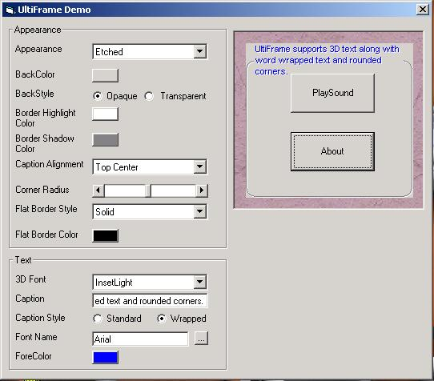



## UltiFrame OCX

### Description

A MS Frame Control replacement. Supports transparent backgrounds, word-wrapped captions, 3D text captions, rounded corners and a few other goodies.
 
### More Info
 
I didn't feel like buying Infragistics frame control so I decided to make one similar. Hope you all enjoy it.

Hopefully none!

             |
---                |---
**Submitted On**   |2002-11-18 18:09:42
**By**             |[Scott Weeks](https://github.com/Planet-Source-Code/PSCIndex/blob/master/ByAuthor/scott-weeks.md)
**Level**          |Advanced
**User Rating**    |5.0 (25 globes from 5 users)
**Compatibility**  |VB 6\.0
**Category**       |[Custom Controls/ Forms/  Menus](https://github.com/Planet-Source-Code/PSCIndex/blob/master/ByCategory/custom-controls-forms-menus__1-4.md)
**World**          |[Visual Basic](https://github.com/Planet-Source-Code/PSCIndex/blob/master/ByWorld/visual-basic.md)
**Archive File**   |[UltiFrame\_14998611182002\.zip](https://github.com/Planet-Source-Code/scott-weeks-ultiframe-ocx__1-40857/archive/master.zip)

